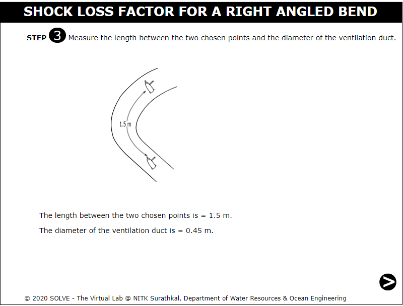

##### These procedure steps will be followed on the simulator

1. When you click on a Resistance and k-factor in the ventilation duct file, a new window will open as shown below.  
 

2. Click on the slider to rotate so that current comes in the circuit board. 
 

3. Click on the power button to start the motor.  
 

4. Click on the knob to set the motor to 300rpm.  
 

5. Click on the hand to measure the inclination of manometer. 
 

6. Click on the NEXT button at the bottom right corner to proceed to the next step. 
 

7. Measure the length between the two chosen points and the diameter of the ventilation duct. 
 

8. Take the following precautions before taking the reading. And click the OK button to continue the experiment. 
 

9. Click on the hand to connect the rubber tube of manometer with pitot tube at point 1. 
 

10. Click on the mover to take the static head reading from the manometer. 
 

11. now connect the rubber tube to pitot tubes total head and take the reading. 
 

12. This time connect the rubber tube to pitot tubes velocity head and take the reading.  
 

13. Click on the NEXT button at the bottom right corner to proceed to the next step. 
 

14. Prepare the observation table for the experiment. Check the required values by inputting the data. 
 

15. Click on the NEXT button at the bottom right corner to proceed to the next step. 
 

16. Connect the rubber tube of manometer with pitot tube at point 2. Click on the mover to take the static head reading from the manometer. 
 

17.  now connect the rubber tube to pitot tubes total head and take the reading. 
 

18.  This time connect the rubber tube to pitot tubes velocity head and take the reading. 
 

19. Click on the NEXT button at the bottom right corner to proceed to the next step. 
 

20. The observation for point 2 is given below and put the required value in calculation to check your results. 
 

21. Click on the NEXT button at the bottom right corner to proceed to the next step. 
 

22. Click on the NEXT button at the bottom right corner to proceed to the next step. 
 

23. Now you can see the result in this last step. 
 

